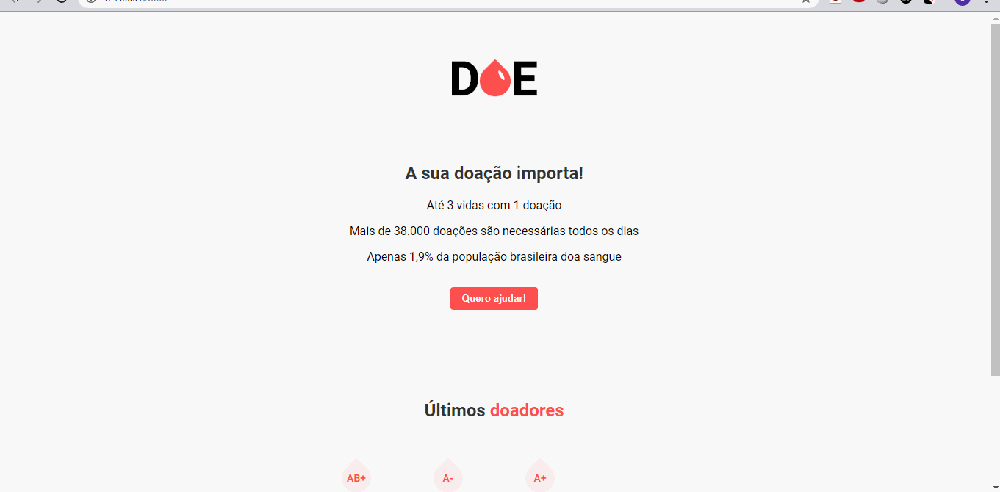

# DOE

Simple web application to register blood donnor and save their data.

### Prerequisites

You'll need to install <a href="https://nodejs.org/en/">node.js.<a>

## Running front-end

The frontend is where the NGO will register it's data and receive an id, so it can login and register their incidents, asking for help.

    

* Step 1 - On your cmd access porject doe folder.
* Step 2 - Run npm install.
* Step 3 - Run npm start.
